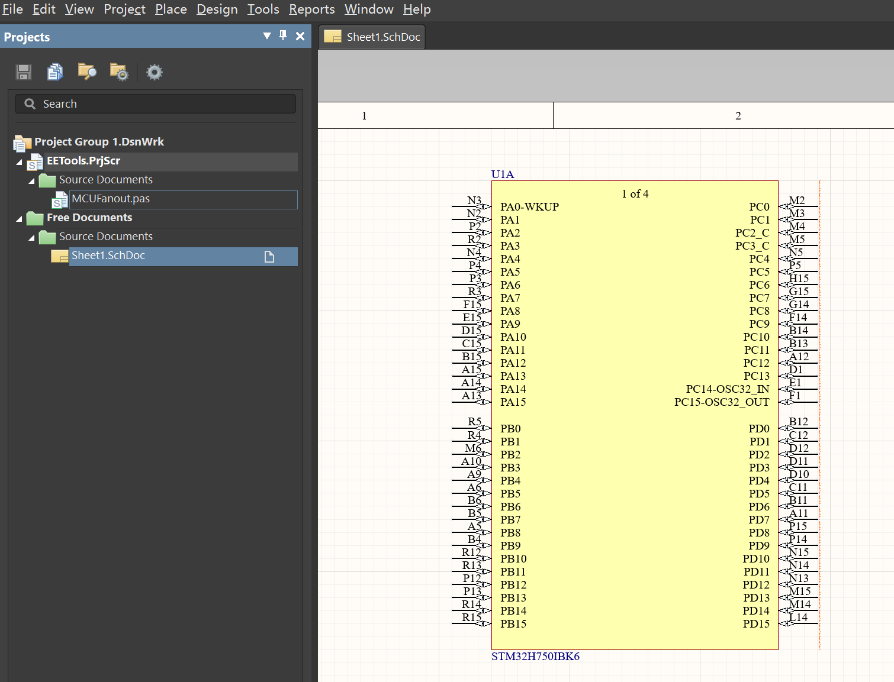
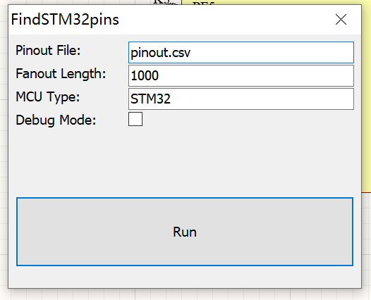
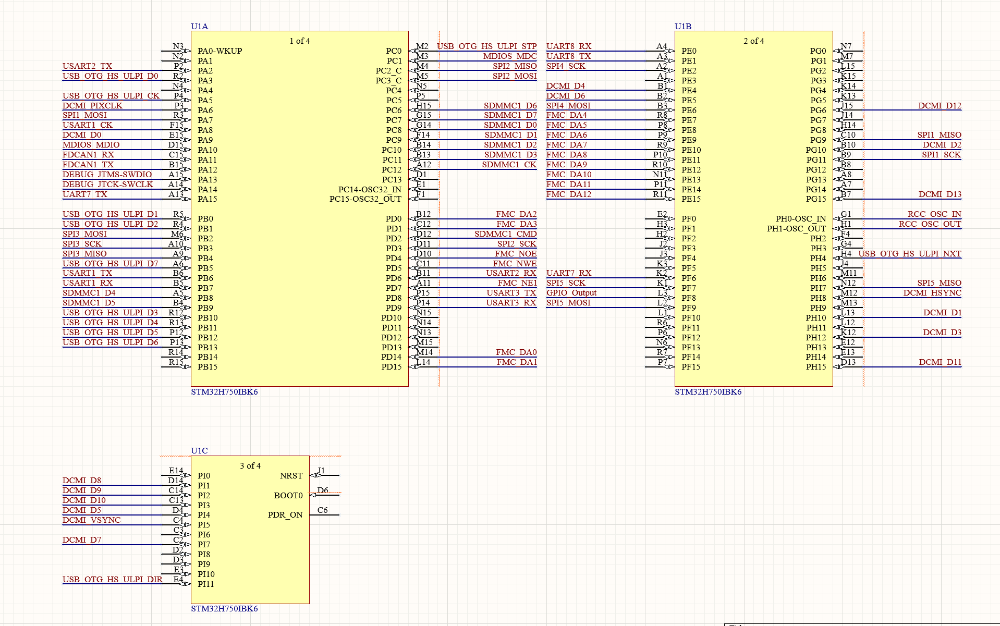

# MCUFanout
Automatically fans out MCUs (STM32 only for now) according to external pin-out file.

## Usage
1. Starting from a CubeMX project, do Pinout->Export pinout without Alt. Functions

2. Load EETools.PrjScr to your workspace.

3. Run MCUFanout.pas, fill in pinout file path, fanout length and MCU type, click Run.

4. Finished.
   

