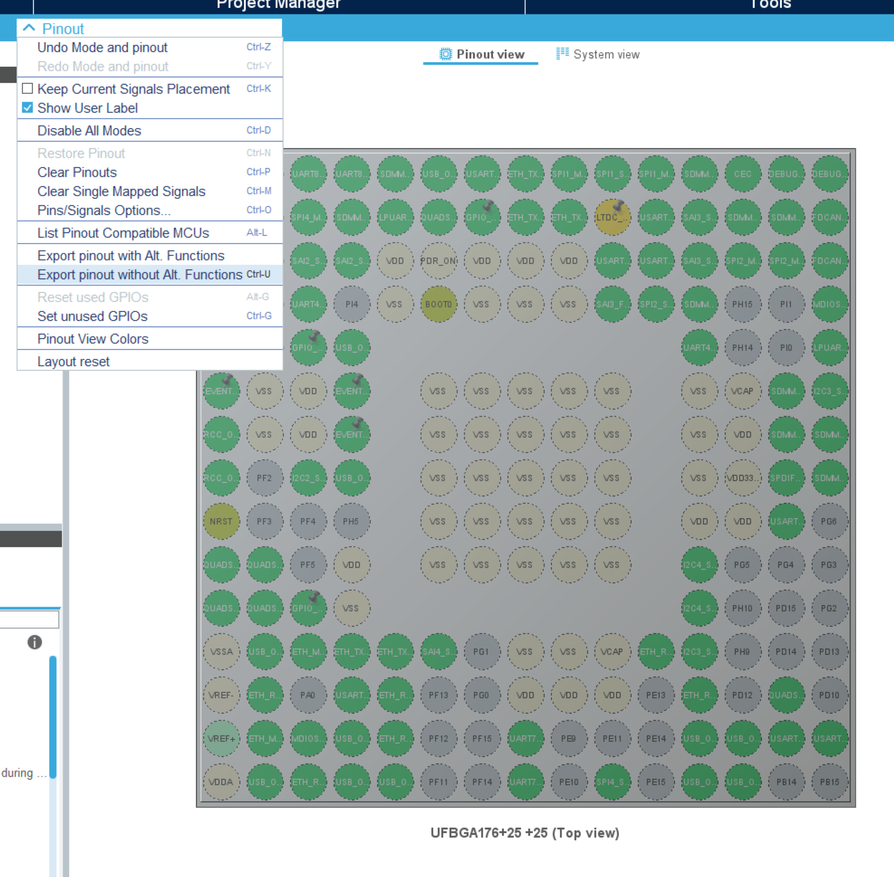
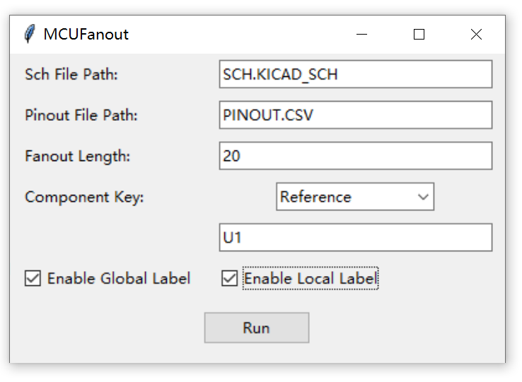
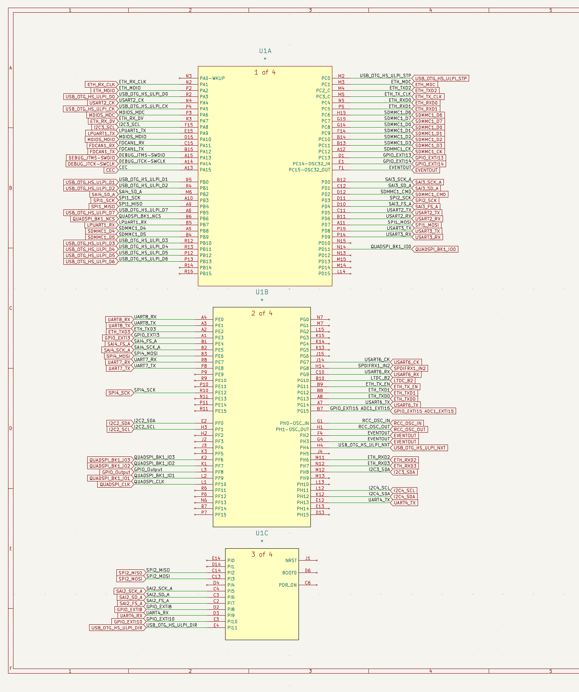

# MCUFanout
Based on API provided by 
 
Automatically fans out MCUs according to external pin-out file.

## Usage
1. Start with a CubeMX project. Other software will be supported in future. Do Pinout->Export pinout without Alt. Functions

2. Get your KiCad schematic ready.

3. Run `MCUFanout.py`, enter paths to schematic file (*.kicad_sch) and the pinout file exported from CubeMX.
   
    `Fanout Length`: The length of fan-out wire, 1 unit = 50 mils (the recommended grid length of KiCad).

    `Component Key`: `Reference` means finding the MCU component by its reference (designator), regex is supported; `Value Prefix` means finding by the prefix of value of components. e.g. when designating `Value Prefix = STM32` the script will fan out all components with values begin with 'STM32', like 'STM32F103...' or 'STM32H750...'.

    `Enable Global/Local Label`: Whether a global/local label showing the functions of pins should be created.

    With the configuration in below, the script will fan out 1000-mils-long wires with both global & local labels from component U1, according to pinout.csv.

4. Press `Run`, then re-open the schematic in KiCad.

